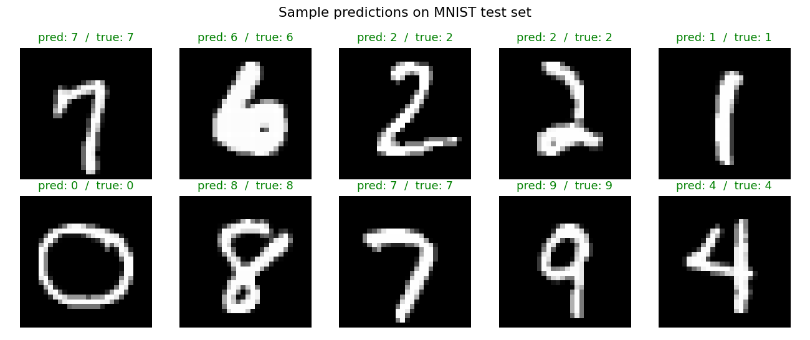
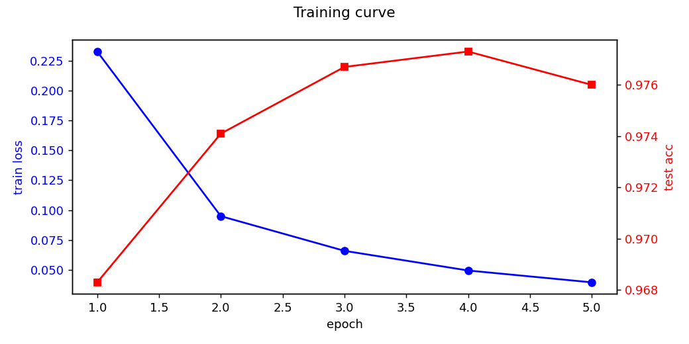
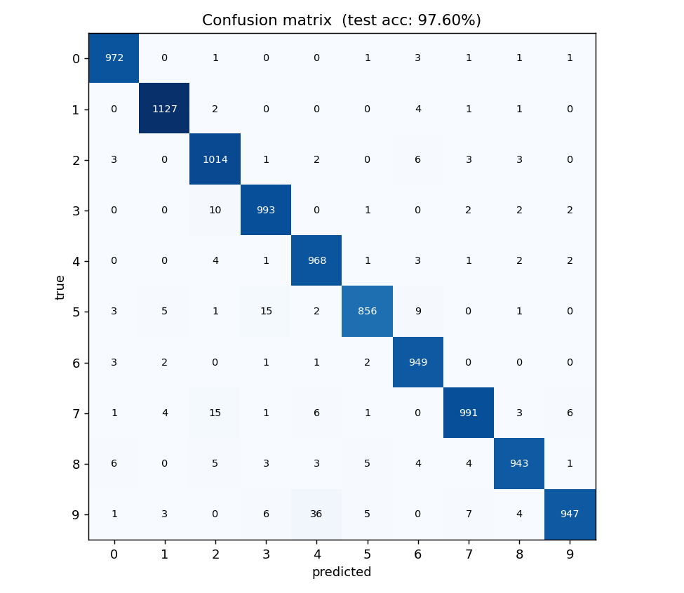

# 手寫數字辨識 — MNIST MLP

一個能辨識手寫阿拉伯數字（0–9）的小型神經網路。給它一張 28×28 的灰階手寫數字圖，它會回傳預測的數字。這是神經網路最經典的入門題目。

## 成果展示

### 隨機抽 10 張測試圖的預測

模型把每張都認對了：

### 訓練曲線

5 個 epoch 訓練過程中，loss 一路下降，準確率在第 4 個 epoch 達到峰值：

### 混淆矩陣（10,000 張測試圖）

對角線是正確答對的，越深表示越多。最常見的混淆是把「9」認成「4」、「7」認成「2」、「5」認成「3」 — 這幾組數字寫法本身就很相像：

