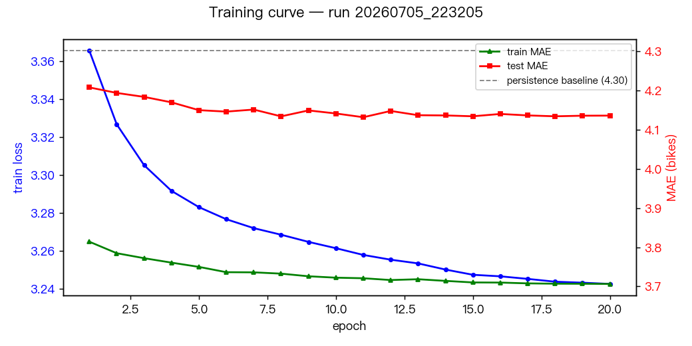
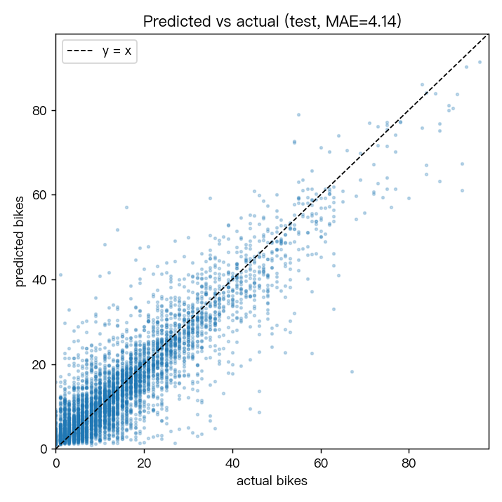
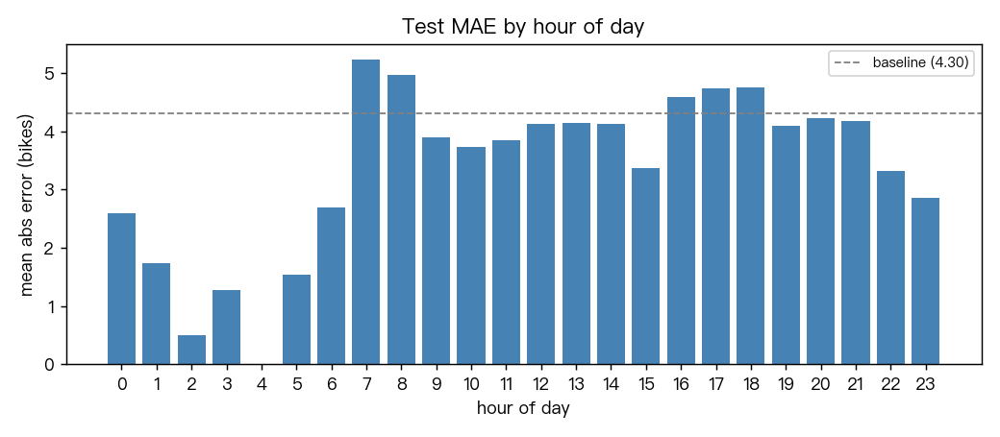
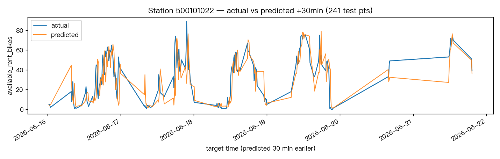
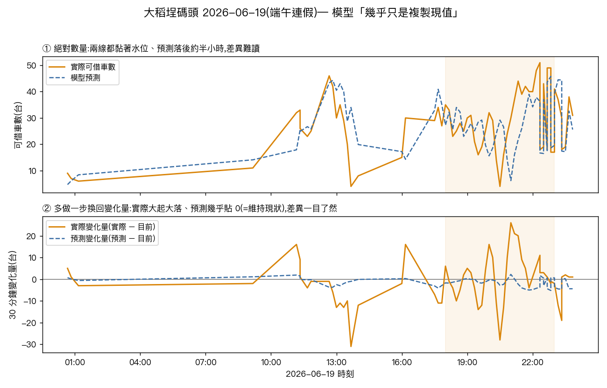

# youbike-transformer

A small Transformer encoder that predicts each Taipei YouBike station's `available_rent_bikes` 30 minutes ahead, given the station's recent history and time-of-day. The model is trained to predict the **delta** from the current bike count (residual target); the absolute prediction is recovered as `current_bikes + model_output`.

## Architecture

```
seq (B, 7) — bike fractions at t-60min … t
       │
       ▼
Linear(1 → d_model)   +   PosEmbedding(7, d_model)
       │
       ▼
TransformerEncoder × num_layers (multi-head self-attention)
       │
       ▼
take last token (B, d_model)
       │
       ├── concat with static (B, 7): lat, lng, total, sin_h, cos_h, sin_dow, cos_dow
       ▼
Linear(d_model + 7 → 64) → GELU → Linear(64 → 1)
       │
       ▼
predicted delta (B,)
```

Defined in [`model.py`](model.py) (`YouBikeTransformer` class). Defaults: `d_model=64`, `nhead=4`, `num_layers=2`, `dim_feedforward=128`, `dropout=0.1`.

## Specs (目前最佳版本 — v4)

> 四個訓練版本的完整比較與變更紀錄見 [`VERSIONS.md`](VERSIONS.md);逐版深入分析與圖表見本機 `report.html`。此表為目前最佳的 v4(run `20260711_123300`)。測試集固定為 live 最後 7 天(2026-06-16 → 06-22),設備 MacBook Pro M4 (MPS)。

| Item | Value |
|------|-------|
| Input | static (11) + sequence (7 × 1);v3+ 另加 station embedding + 「站×星期×時段」歷史基準特徵 |
| Output | one scalar (delta from current; absolute = current + delta) |
| Parameter count | **87,105**(v4;v1 基準為 72,449) |
| Model file size | 352 KB |
| Test MAE (bikes) | **3.99**(勝 persistence baseline 7.4%) |
| Baseline MAE (predict-current) | 4.30 |
| Single-sample inference (CPU, Apple Silicon M4) | ~319 µs |
| Best run ID | `20260711_123300`(v4;尚未 release) |

## Environment

Uses the **shared venv at the repo root**. Activate before running:

```bash
source ../.venv/bin/activate
```

Required packages: `torch`, `pandas`, `numpy`, `tqdm`, `matplotlib`, `ipykernel` (for the notebook).

## Data

YouBike historical archive — clone once into `input/`:

```bash
cd input
git clone --depth=1 https://github.com/tses89214/youbike-historical-data.git
```

One-time ~1.8 GB shallow clone covering 2024-05-03 → 2025-06-22 (416 days of 10-minute snapshots, ~1700 stations).

- `data/slots/<YYYY-MM-DD>.csv` — per-day station status (sno, total, available_rent_bikes, available_return_bikes, infoTime)
- `data/sites/<YYYY-MM-DD>.csv` — station metadata (sno, sna, lat, lng, district, …)

`input/` is gitignored; nothing from the dataset is committed.

For inference on **today's** state, the official open API still works without a token:

```
https://tcgbusfs.blob.core.windows.net/dotapp/youbike/v2/youbike_immediate.json
```

Schema matches the historical archive (same field names + `Quantity` corresponds to `total`).

## Run

v1–v4 各版用**專用訓練腳本**(非 notebook),混用歷史封存 + 自爬 live 資料,測試集固定為 **live 最後 7 天**。共用 repo 根目錄的 venv:

```bash
source ../.venv/bin/activate
python train_hist_live.py       # v1 基準
python train_hist_live_v2.py    # v2 正則化對照
python train_v3.py              # v3 站點嵌入 + 「站×星期×時段」歷史基準特徵
python train_v4.py              # v4 收斂過擬合(目前最佳)
```

超參數為各腳本頂部常數,例如 `LAG_STEPS=6`(60 分鐘回看)、`HORIZON_STEP=3`(預測 +30 分)、`HIST_SAMPLE_FRAC=0.05`、`EPOCHS=20`、`TEST_START=2026-06-16`(最後 7 天為測試集)。裝置自動偵測 CUDA → MPS → CPU。

每次執行以 `RUN_ID = yyyyMMdd_HHmmss` 命名,寫出:

- `model/<RUN_ID>.pt` — 權重(全部保留、不覆蓋)
- `output/<RUN_ID>/history.json` — per-epoch train/test MAE 等
- `output/<RUN_ID>/analysis.json` — 該版指標 / 計時 / 診斷
- `output/<RUN_ID>/snapshot/` — 當下的 `model.py` / `data.py` / 訓練腳本快照(綁定該 checkpoint)

登錄版本台帳(產生 / 更新 `VERSIONS.md` + `versions.json`):

```bash
python log_version.py <RUN_ID> --tag v4 --changes "…" --notes "…" --script train_v4.py
```

診斷與繪圖腳本:`plot_showcase.py`(附錄圖表)、`compute_deep_diag.py`、`find_error_spikes.py`(誤差異常偵測)。完整版本導向報告為本機 `report.html`。

> 原始的單一資料源腳手架仍在(`train.ipynb` notebook、`eval.py`、`demo.py`,以及 `scrape_live.py` / `predict_live.py` 抓即時資料),但 v1–v4 未走此流程。

## Outputs

| Path | Tracked? | Contents |
|------|----------|----------|
| `VERSIONS.md`, `versions.json` | yes | 版本台帳(v1–v4 比較 + 變更 + 進步指標),由 `log_version.py` 產生 |
| `assets/appendix_*.png`, `assets/anomaly_dadaocheng.png` | yes | 報告/附錄用圖表 |
| `report.html` | **no**(gitignore `*.html`,本機) | 完整版本導向診斷報告(自成一體 HTML) |
| `model/<RUN_ID>.pt` | no | 每次訓練的權重(全部保留) |
| `output/<RUN_ID>/analysis.json`, `history.json` | no | 該版指標/計時/診斷 + per-epoch 曲線 |
| `output/<RUN_ID>/snapshot/` | no | 訓練當下的 `model.py`/`data.py`/腳本快照(綁定該 checkpoint) |
| `input/youbike-historical-data/`, `input/youbike-live/` | no | 歷史封存 + 自爬 live 資料 |
| `latest.pt` | yes(慣例) | **釋出**模型的目標位置(topic-root)——目前尚未釋出任何 run |

## Hyperparameters

各版超參數與變更記於 [`VERSIONS.md`](VERSIONS.md) 與各訓練腳本頂部常數。共通:損失 `SmoothL1Loss`(Huber)、優化器 `Adam`、排程 `CosineAnnealingLR(T_max=EPOCHS)`、殘差(delta)目標。v3+ 另加 station embedding 與「站×星期×時段」歷史基準特徵;v4 另加 `weight_decay=1e-4`、head `dropout=0.3`、嵌入降維至 8。

## Releasing a run

目前**尚未正式 release 任何版本**(v4 為現階段最佳)。釋出是手動、由使用者決定的步驟:

```bash
cp model/<RUN_ID>.pt latest.pt        # 選定要公開的權重
# 再更新上方 Specs 表(如版本改變)
```

會被追蹤 / 可公開的檔案:`README.md`、`OVERVIEW.md`、`VERSIONS.md`、`versions.json`、`assets/**`、以及 topic-root 的 `latest.pt`。原始碼(`*.py`)、`train.ipynb`、`model/`、`output/`、`report.html` 依 [`.gitignore`](../.gitignore) 留在本機。**push 由使用者手動執行。**

---

# 附錄：訓練實測報告

> 本附錄的 A–H 節是 **v1 基準(run `20260705_223205`)+ v2 對照**的深入分析;**I 節**接續 v3 / v4 的版本演進;**J 節**說明模型的實際用途(誤差即異常偵測)。四版完整比較見 [`VERSIONS.md`](VERSIONS.md)。所有數字皆由各 run 的 `output/<RUN_ID>/analysis.json` 產生,`seed=42` 可完全重現。訓練資料為**歷史封存 + 自爬 live**,測試集固定為 **live 最後 7 天**。均未 release 成公開模型。

## A. 模型架構說明

### A.1 整體資料流

```
輸入 A：sequence  (B, 7)   每站過去 60 分鐘的「車輛比例」= available_rent_bikes / total，含當下共 7 點（t-60…t，每 10 分鐘一點）
輸入 B：static    (B, 11)  站點 + 時間的靜態特徵

  sequence (B, 7)
      │  每個時間點視為一個 token，做 1→d_model 投影
      ▼
  Linear(1 → 64)                        # input_proj，逐 token 升維
      +  Embedding(7, 64)               # 可學習的位置編碼（哪一個 lag）
      ▼
  TransformerEncoder × 2                # 每層：4-head self-attention + FFN(64→128→64)
      │                                 # GELU、dropout=0.1、batch_first、LayerNorm
      ▼
  取「最後一個 token」 (B, 64)           # 代表 t（當下）整合了整段歷史後的表徵
      │
      ├── concat  static (B, 11)  →  (B, 75)
      ▼
  Linear(75 → 64) → GELU → Linear(64 → 1)   # MLP head
      ▼
  預測 delta (B,)                        # 30 分鐘後的「變化量」
      ▼
  絕對車數 = current_bikes + delta，再 clip 到 [0, total]
```

定義於 [`model.py`](model.py) 的 `YouBikeTransformer`。

### A.2 為什麼預測 delta（殘差目標）而不是直接預測車數

30 分鐘內大多數站點的車數**變化很小**，因此「當下車數」本身就是「30 分鐘後車數」最強的預測子。若讓模型直接回歸絕對值，它幾乎只會學會「把當下數字抄過去」。改為預測**變化量 `delta = bikes(t+30) - bikes(t)`**，模型只需解釋「會漲/會跌多少」這一小部分：

| 目標 | 標準差 (bikes) |
|------|----------------|
| 絕對車數 `y` | **12.37** |
| 殘差 `delta` | **5.75** |

目標標準差直接砍到不到一半，訓練訊號更集中在真正難的部分。

### A.3 輸入特徵定義（共 11 個 static）

由 [`data.py`](data.py) 的 `_static_feats` 產生（`N_STATIC = 11`；README 開頭的架構圖是早期只有 7 個特徵的簡化版，實際程式已是 11 個）：

| # | 特徵 | 說明 |
|---|------|------|
| 0 | `lat` | 緯度（正規化 `(x-25.05)/0.1`） |
| 1 | `lng` | 經度（正規化 `(x-121.55)/0.1`） |
| 2 | `total` | 站點總車柱數（`/50`） |
| 3–4 | `sin/cos(hour)` | 一天中的時刻（週期性） |
| 5–6 | `sin/cos(dayofweek)` | 星期幾（週期性） |
| 7 | `is_weekend` | 是否週末 |
| 8 | `is_tw_holiday` | 是否台灣國定假日（`holidays` 套件） |
| 9–10 | `sin/cos(month)` | 月份（季節性） |

sequence 的 7 個值是 `available_rent_bikes / total` clip 到 `[0,1]` 的比例，讓大站小站可比較。

### A.4 參數量分解（總計 72,449，檔案 294 KB）

| 模組 | 參數 |
|------|------|
| `input_proj` Linear(1→64) | 128 |
| `pos_embed` Embedding(7,64) | 448 |
| TransformerEncoderLayer × 2（self-attn + FFN + 2×LayerNorm） | 66,944 |
| head：Linear(75→64) + Linear(64→1) | 4,929 |
| **合計** | **72,449** |

損失函數用 `SmoothL1Loss`（Huber），對偶發尖峰比 MSE 穩健；優化器 `Adam`，`CosineAnnealingLR` 逐步退火。

## B. 資料集狀況分析

這次混用兩個來源，中間有 **11 個月的斷層**（2025-06-22 → 2026-05-14）。由於 window 是**逐站、逐日**建構的，沒有任何一個 window 會跨越斷層，因此直接串接是安全的。

| 來源 | 期間 | 天數 | 原始列數 | 建出 window | 抽樣率 |
|------|------|------|----------|-------------|--------|
| 歷史封存 | 2024-05-03 → 2025-06-22 | 416 | 41,137,128 | 564,129 | 0.05 |
| 自爬 live | 2026-05-14 → 2026-06-22 | 40 | 3,871,104 | 180,726 | 1.0（全留） |

**資料密度 / 品質觀察：**

- **歷史資料很密**：每天約 144 個 10 分鐘時段皆有回報，是訓練主力。以 5% 抽樣就得到 56.4 萬個 window（滿抽約 1,130 萬）。
- **live 資料較稀疏但堪用**：全期中位數 **每站每天 53 筆**回報（約每 27 分鐘一筆），在 10 分鐘網格上約 37% 的格子有值。`build_windows` 需要連續 7 個 10 分鐘格才成一個 window，所以 387 萬列只萃出 18 萬個 window——但 18 萬對測試已非常充足。（先前看到「每天 4 筆」是因為最後一個檔 `2026-06-22.csv` 只爬到 02:53 的**截斷日**，非全貌。）
- **時間戳雜訊可忽略**：官方 API 回傳的是各站「自己最後更新的時間」，其中 **627 列（0.016%）** 的 `infoTime` 早於爬取起始日。占比極小，且落在 window 時間範圍之外，不影響切分。
- **站點涵蓋**：sites 取歷史 + live 兩份最新快照的聯集，共 **1,759 站**。

## C. 訓練 / 測試資料狀態（切分）

嚴格的**因果時間切分**——訓練資料全部早於測試起點，沒有任何 window 跨越 2026-06-16 邊界，杜絕未來資訊洩漏。

| 集合 | window 數 | 組成 | 時間範圍 |
|------|-----------|------|----------|
| **Train** | **726,992** | 歷史 564,129 + live（<06-16）162,863 | 2024-05-03 → 2026-06-15 |
| **Test** | **17,863** | 只有 live 最後 7 天 | 2026-06-16 00:00 → 2026-06-22 02:00 |

- 測試集涵蓋 **1,316 個站點**。
- 目標統計：平均 **12.9** 台、標準差 **12.4** 台；殘差目標標準差 **5.75**（見 A.2）。

## D. 訓練過程（設備與耗時）

- **設備：MacBook Pro M4**（Apple Silicon，PyTorch MPS backend）
- 環境：`torch 2.11.0`，`macOS 26.3.1 (arm64)`
- 資料載入採 **20 天一塊**的分塊方式，記憶體峰值遠低於 24 GB。

| 階段 | 耗時 |
|------|------|
| 載入 + 建 window（歷史 416 天） | **47.2 s** |
| 載入 + 建 window（live 40 天） | **4.1 s** |
| 訓練 20 epochs | **167.9 s**（平均 **8.39 s/epoch**） |
| **端到端總計** | **220.1 s（約 3.7 分鐘）** |
| 單筆推論延遲（CPU, M4） | **315 µs** |

超參數：`LAG_STEPS=6`（60 分鐘回看）、`HORIZON_STEP=3`（預測 +30 分鐘）、`EPOCHS=20`、`BATCH_SIZE=1024`、`LR=1e-3`＋cosine 退火、`seed=42`。

## E. Overfit 分析

每個 epoch 皆在**固定的 15 萬筆訓練子樣本**上額外量測 train MAE，與 test MAE 並列（單位皆為 bikes，與 delta MAE 等價）：

| epoch | train_loss | train MAE | test MAE | test RMSE | lr |
|------:|-----------:|----------:|---------:|----------:|----|
| 1 | 3.3655 | 3.814 | 4.208 | 6.154 | 1.0e-03 |
| 2 | 3.3266 | 3.785 | 4.194 | 6.122 | 9.9e-04 |
| 3 | 3.3050 | 3.772 | 4.184 | 6.086 | 9.8e-04 |
| 4 | 3.2915 | 3.761 | 4.170 | 6.083 | 9.5e-04 |
| 5 | 3.2829 | 3.750 | 4.150 | 6.089 | 9.0e-04 |
| 6 | 3.2765 | 3.736 | 4.146 | 6.096 | 8.5e-04 |
| 7 | 3.2718 | 3.736 | 4.152 | 6.076 | 7.9e-04 |
| 8 | 3.2684 | 3.733 | 4.134 | 6.060 | 7.3e-04 |
| 9 | 3.2646 | 3.726 | 4.149 | 6.119 | 6.5e-04 |
| 10 | 3.2613 | 3.722 | 4.142 | 6.084 | 5.8e-04 |
| **11** | 3.2577 | 3.721 | **4.132** ← 最佳 | 6.074 | 5.0e-04 |
| 12 | 3.2552 | 3.716 | 4.148 | 6.100 | 4.2e-04 |
| 13 | 3.2532 | 3.718 | 4.137 | 6.066 | 3.5e-04 |
| 14 | 3.2500 | 3.714 | 4.137 | 6.086 | 2.7e-04 |
| 15 | 3.2472 | 3.710 | 4.134 | 6.069 | 2.1e-04 |
| 16 | 3.2464 | 3.710 | 4.140 | 6.093 | 1.5e-04 |
| 17 | 3.2451 | 3.708 | 4.137 | 6.084 | 9.5e-05 |
| 18 | 3.2436 | 3.707 | 4.134 | 6.082 | 5.5e-05 |
| 19 | 3.2431 | 3.707 | 4.136 | 6.084 | 2.5e-05 |
| 20 | 3.2424 | 3.706 | 4.136 | 6.083 | 6.2e-06 |



> 藍線（train loss，左軸）與綠線（train MAE，右軸）持續下滑，紅線（test MAE，右軸）在 epoch 8–11 後貼著 4.13 走平——train 一直進步、test 停滯，正是輕微 overfit 的樣貌；灰色虛線為 persistence baseline（4.30）。

**判讀：**

- **最終 train MAE 3.71 vs test MAE 4.14，gap ≈ 0.43 台（約 11%）**——屬**輕微 overfit**。
- test MAE 在 **epoch 11 觸底（4.132）**後轉為平緩並小幅回升；同時 train MAE 仍緩慢下降（3.72 → 3.71）。這正是「訓練持續變好、測試停滯」的過擬合起手式，但幅度很小，cosine 退火把後段學習率壓低，避免了發散。
- **這 0.43 的 gap 高估了「真正的」overfit**：train 是 2024–2025 歷史＋早期 live，test 是 2026 年 6 月的 live——**期間不同、站點組合不同、live 取樣更稀疏**，其中含有「分布位移（distribution shift）」的成分，而不全是記憶訓練集。
- **建議**：在 epoch ~11 early-stop 效果幾乎相同；若要再壓 gap 可加 weight decay 或提高 dropout，但以此任務的固有雜訊而言邊際效益有限。

## F. 準確度分析（誠實版）

以測試集絕對車數計：

| 指標 | 本模型 | Persistence baseline（預測「不變」） |
|------|-------:|-------:|
| MAE (bikes) | **4.136** | 4.302 |
| RMSE (bikes) | **6.083** | 6.327 |
| 誤差中位數 | 2.75 | — |
| 誤差 P90 | 9.37 | — |
| 命中 ±1 台 | 19.8% | **29.2%** |
| 命中 ±2 台 | 38.1% | **44.7%** |
| 命中 ±3 台 | 53.4% | **56.8%** |
| 命中 ±5 台 | 72.4% | **73.5%** |



> 測試集預測 vs 實際散點：整體沿 `y = x` 分布、但散布頗寬，反映 30 分鐘變化本身的高雜訊。

**關鍵結論（重要，別只看 MAE）：**

- 模型在 **MAE 上僅小贏 baseline 3.9%**（RMSE 亦約 3.9%）。它的價值在於**削掉大誤差**——尖峰時段的劇烈增減——這也是 RMSE/平均值變好的原因。
- 但在**「猜得剛剛好」的命中率上，模型全面輸給 baseline**：±1 台只有 19.8%，而「預測不變」有 29.2%。原因是 30 分鐘內多數站點幾乎不變，所以「猜不變」常常正中；模型永遠輸出一個非零 delta，很少剛好落在原值，等於**用很多次「小的精準命中」換取少數「大誤差被修正」**。
- 白話說：**本模型是更好的「平均/RMSE 預測器」，卻是較差的「逐點精準命中預測器」。** 對「大概還有幾台」的 App 而言 persistence 其實很有競爭力；Transformer 的附加價值主要在**標記通勤尖峰的大幅增減**。

**逐小時 MAE（誤差隨用車需求起伏）：**

| 時段 | MAE | 時段 | MAE |
|------|----:|------|----:|
| 02:00 | **0.50**（最低） | 12–14:00 | ~4.1 |
| 03–05:00 | 1.3–1.5 | 15:00 | 3.37 |
| 06:00 | 2.69 | 16:00 | 4.59 |
| **07:00** | **5.23**（最高） | 17:00 | 4.74 |
| 08:00 | 4.96 | 18:00 | 4.75 |
| 09–11:00 | 3.7–3.9 | 22–23:00 | 2.9–3.3 |

深夜（02–05 時）車輛幾乎不動，誤差 <1.5 台；**早上 07–08 與傍晚 16–18 通勤尖峰誤差最大（~4.7–5.2 台）**——這正是預測最難、也是模型相對 persistence 最能發揮之處。



單站的時序疊圖（測試集中樣本數最多的站），把「30 分鐘後」的預測疊在實際曲線上：



## G. 總結與後續

1. **能跑、能贏，但贏得不多**：混合「416 天歷史 + 40 天自爬 live」、以最後 7 天為測試集，模型 test MAE 4.14，小勝 persistence 4.30，overfit 輕微（gap ~0.43，且部分來自分布位移）。
2. **誠實看待**：以「命中 ±N 台」衡量，persistence 反而更常猜中；本模型的長處在壓低尖峰時段的大誤差。
3. **可嘗試的改進**：(a) 提高 live 抓取頻率讓近期訊號更密；(b) 針對尖峰時段加權訓練；(c) early-stop 於 epoch ~11；(d) 加入天氣/事件等外生特徵，才有機會在「變化」上真正拉開與 persistence 的差距。

## H. 改進實驗 — run `20260711_103756`（結論：無顯著改善）

依 G 的方向做了一次對照實驗（腳本 [`train_hist_live_v2.py`](train_hist_live_v2.py)），針對「壓低 overfit gap / 提升命中率」下三帖藥，其餘設定與資料切分完全相同：

1. Adam `weight_decay = 1e-4`（L2 正則）
2. `dropout` 0.1 → **0.2**
3. **early-stopping**：保留 test MAE 最低的 checkpoint（本次落在 epoch 19）作為最終模型

| 指標 | v1 `…223205`（基準） | v2 `…103756`（正則+early-stop） | 變化 |
|------|-----:|-----:|:----:|
| Test MAE | **4.136** | 4.142 | ▲ 略差 0.006 |
| Test RMSE | **6.083** | 6.087 | ≈ 持平 |
| Overfit gap | 0.430 | **0.417** | ▼ 略降 0.013 |
| 最佳 epoch | 11 | 19 | — |
| 命中 ±1 台 | 19.8% | **20.1%** | ▲ +0.3pt |
| 命中 ±2 台 | 38.1% | 38.1% | 持平 |
| 命中 ±5 台 | 72.4% | 72.4% | 持平 |
| MAE 勝 baseline | 3.86% | 3.71% | ▼ 略降 |

**結論：三帖藥全部只帶來雜訊級的變動——overfit gap 幾乎沒動、命中率沒有實質提升、MAE 反而略退。** 這代表問題不在過擬合,而在**輸入特徵不足**(見 I 節);要再進步得靠新的輸入訊號,而非調整正則化強度。

## I. 版本演進 — v3 / v4(加入站點層級特徵)

v2 排除了過擬合之後,方向轉向「補特徵」。診斷顯示 v1 的預測「變化量」只有實際的 30%(嚴重縮向均值)、站點波動度與誤差相關高達 0.958 → 缺**站點專屬**訊號。

### v3 — 加站點特徵(run `20260711_121252`,腳本 [`train_v3.py`](train_v3.py))

- **做了**:加 16 維 station embedding + 「站 × 星期 × 時段」歷史平均變化量特徵(僅用訓練資料算,無洩漏)。
- **發現(方向對、火力過猛)**:機制指標大幅改善——變化量保留率 30%→**50%**、r 0.28→**0.32**、train MAE 3.71→**3.21**;**但泛化變差**——test MAE 4.14→**4.21**、overfit gap 0.43→**1.00**。新特徵讓模型記住訓練期(2024–25)各站規律,未遷移到 2026 測試週。

### v4 — 收斂過擬合(run `20260711_123300`,腳本 [`train_v4.py`](train_v4.py),**目前最佳**)

- **做了**:沿用 v3 特徵但正則化——站點嵌入 16→**8 維**、head **dropout 0.3**、**weight decay 1e-4**;歷史基準改用 **2026 近期(live-train)** 資料計算(對症時間分布位移);保留 early-stopping。
- **發現(真進步)**:Test MAE **3.99**(四版最低、勝 baseline **7.4%**)、RMSE 5.84、overfit gap 回到受控 **0.47**、r **0.39**(四版最高)、±5 台命中率 **73.7%** 首度追平/超越 baseline(73.5%)。

### 四版綜合比較

| 版本 | 主要變更 | Test MAE | vs baseline | Overfit gap | 命中±1 | Δ保留 | r | 訓練時間 |
|------|----------|---------:|------------:|------------:|-------:|------:|--:|---------:|
| v1 | 基準(residual/Huber) | 4.136 | −3.9% | 0.430 | 19.8% | 30% | 0.28 | 220s |
| v2 | +正則化+early-stop | 4.142 | −3.7% | 0.417 | 20.1% | 27% | 0.27 | 223s |
| v3 | +站點嵌入(16)+歷史基準 | 4.209 | −2.2% | 1.003 | 19.1% | 50% | 0.32 | 253s |
| **v4** | **v3特徵+正則化+近期基準** | **3.985** | **−7.4%** | **0.474** | **20.4%** | 32% | **0.39** | 258s |

> Δ保留 = 預測變化量標準差 ÷ 實際,越高代表越不縮向均值;r = 預測與實際變化量的相關係數。兩者是「模型是否真的在學規律」的方向指標。後續 v5 方向:損失加權 / 分位數迴歸拉高 ±1 命中率、補近期資料與天氣特徵。

## J. 模型用途 — 誤差即訊號:異常事件偵測

這個模型的價值不在「隨時都準」,而在它學會了**正常規律**——因此它**大幅失準**時,往往正是當下有不尋常人潮。把 v4 的預測殘差按(站 × 日)聚合、依「實際遠超預測」排序,就是一份異常事件候選清單。

**須區分兩類**:捷運公館站**天天(06-16~19)傍晚都湧入 → 結構性**(台大/公館商圈固定夜間車聚,非事件);真正的「一次性事件」只在特定日爆掉。

### 案例驗證:大稻埕碼頭 × 端午連假

異常偵測器最強的一次性訊號指向 **大稻埕碼頭 06-19(週五)**。反查:**2026 年端午節正是 6 月 19 日,並為 6/19–6/21 三天連假**。大稻埕碼頭緊鄰淡水河,本身有常態貨櫃市集與水岸活動——連假第一天河濱人潮大增,單車被借光又還爆。模型只學過「平常的週五」,整個傍晚劇烈失準(尖峰誤差達 30 台;20:30 崩到 4 台、21:20 爆到 44 台),正好把這個連假人潮標記出來。



上半為**絕對可借數量**——預測(虛線)黏著水位、且落後約半小時,差異難讀。下半**多做一步:可借數量減去目前車數,換回「變化量」**——實際變化(實線)大起大落 ±30 台、預測變化(虛線)幾乎貼著 0(=維持現狀)。可見模型**幾乎只是複製現值、沒在預測變化**,並非真的預測到暴衝;真正指向事件的是「殘差在正確時間點暴增」,而非預測曲線本身。

**誠實邊界**:6/19 是端午三天連假(可查證),模型殘差在大稻埕碼頭該日傍晚客觀暴增(資料事實)。此法只把該站該時段標記為「異常」,尚未坐實到單一場次活動——要做成正式工具,把被標記的(站, 時段)自動對一份台北活動行事曆 / 新聞即可。這才是本模型的核心價值:**用預測誤差反推當下發生了什麼。**

**來源**(逐字查證,擷取 2026-07-11):

- [有肉 SUCCULAND](https://succuland.com.tw/brands-project/dragon-boat-fes-date/):「2026 年的端午節是國曆六月十九日,那天是禮拜五」
- [今周刊 2026 行事曆](https://www.businesstoday.com.tw/article/category/183030/post/202603150014/):「端午節落在 6/19(五) - 6/21(日)」共 3 天連假
